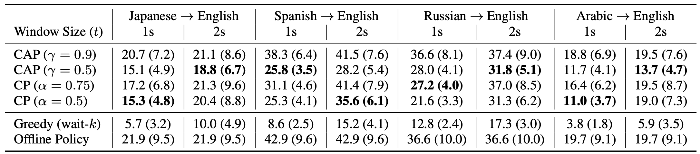

# Simultaneous Speech to Speech Translation w/ Whisper


This repository contains code for the INTERSPEECH 2023 paper "Learning When to Speak: Latency and Quality Trade-offs for Simultaneous Speech-to-Speech Translation with Offline Models" ([link](https://www.isca-archive.org/interspeech_2023/dugan23_interspeech.pdf)). In our paper we introduce simple techniques for converting offline speech to text translation systems (like whisper) into real-time simultaneous translation systems.

## Installation
### Step 1: Install portaudio (required for PyAudio)
**Windows**

Pyaudio seems to compile portaudio upon installation automatically. No manual installation is needed.

**Linux**

Download the portaudio source from https://files.portaudio.com/download.html.

Extract the source into its own directory and compile portaudio using `./configure && make install`.

**Mac**
```
brew install portaudio
```
### Step 2: Clone Repository
Clone the repo and cd into the main directory
``` 
git clone https://github.com/liamdugan/speech-to-speech.git
cd speech-to-speech
```

### Step 3: Create Environment and install dependencies 
**Conda** (must be Python 3.8 or higher)
```
conda env create -n s2st python=3.8
conda activate s2st
pip install -r requirements.txt
```
**Venv** (must be Python 3.8 or higher)
```
python -m venv env
source env/bin/activate
pip install -r requirements.txt
```
and you're good to go!

## Usage

First populate the `api_keys.yml` file with your API keys for both OpenAI and ElevenLabs. For OpenAI go to [https://platform.openai.com/account/api-keys](https://platform.openai.com/account/api-keys) and for ElevenLabs go to [https://api.elevenlabs.io/docs](https://api.elevenlabs.io/docs).

After you are finished use `speech-to-speech.py` to run the system. Add the `--use_local` flag to use the local version of whisper (model size and input language will be taken from the `config.yml` file). The full options are listed below
```
$ python speech-to-speech.py -h
  -h, --help           show this help message and exit
  --mic MIC            Integer ID for the input microphone (default: 0)
  --use_local          Whether to use local models instead of APIs
  --api_keys API_KEYS  The path to the api keys file (default: api_keys.yml)
  --config CONFIG      The path to the config file (default: keys.yml)
```

This script will default to using the Whisper API if `--use_local` is not specified. If it is specified, it will default to using the GPU for the whisper model if it is available. It is highly recommended to use the API if your machine does not have access to a large CUDA-capable GPU.

### Note: Microphone Selection
If you run the `speech-to-speech.py` script with an invalid microphone ID then the following message will be printed
```
$ python speech-to-speech.py --mic 10
Microphone Error: please select a different mic. Available devices:
ID: 0 -- Liam’s AirPods
ID: 1 -- Sceptre Z27
ID: 2 -- MacBook Pro Microphone
ID: 3 -- MacBook Pro Speakers
ID: 4 -- ZoomAudioDevice
Please quit with Control-C and try again
```
This will allow you to pick the desired microphone from the list.

### Note: Configuration
To edit the policy used for speaking output phrases, directly edit (or make copies of) the `config.yml` file. Fields of particular importance are the policy settings (`policy`, `consensus_threshold`, `confidence_threshold`, and `frame_width`), which can have a large impact on the final performance. 

## Evaluation
Below is a table showing the evaluation results (in BLEU and Average Lagging) for the four policies `greedy`, `offline`, `confidence`, and `consensus` using Whisper Medium on the CoVoST2 dataset - see the paper for more details on the evaluation setup.



To reproduce these results run the `evaluation/pipeline.py` script. This script takes in elements from the CoVoST2 dataset and simulates a simultaneous environment by feeding the model portions of the audio in increments of `frame_width`.

## Contribution
We appreciate any and all contributions but especially those containing implementations of new translators and vocalizers. 

To implement a new translator simply add a new subfolder under `/translators` and create a class that implements the `Translator` interface. Likewise for vocalizers, simply add a new subfolder under `/vocalizers` and create a class that implements the `Vocalizer` interface. In particular we would love to have implementations for `whisper.cpp` and a local TTS system (possibly `balacoon` or some other fine-tuned `tacotron`).

## Citation
If you use our code or findings in your research, please cite us as:
```
@inproceedings{dugan23_interspeech,
  author={Liam Dugan and 
          Anshul Wadhawan and 
          Kyle Spence and 
          Chris Callison-Burch and 
          Morgan McGuire and 
          Victor Zordan},
  title={{Learning When to Speak: Latency and Quality Trade-offs for Simultaneous Speech-to-Speech Translation with Offline Models}},
  year=2023,
  booktitle={Proc. INTERSPEECH 2023},
  pages={5265--5266}
}
```
